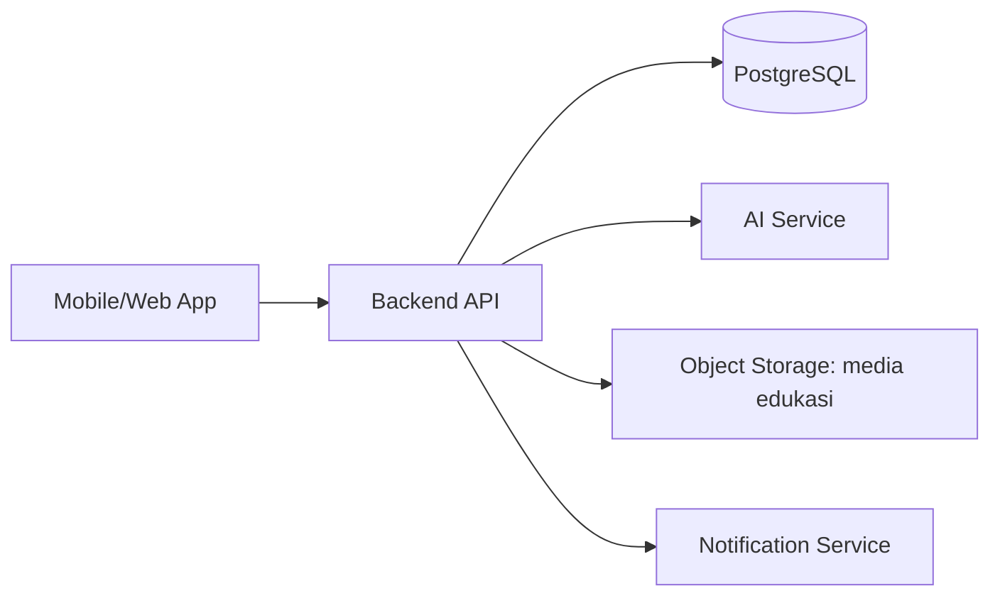
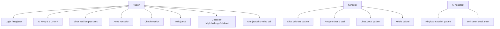
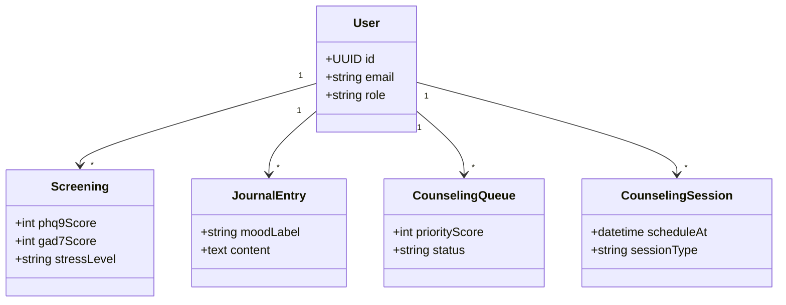

# Mental_Health-app

## 1. Penjelasan Konsep Solusi
Mental_Health-app adalah platform konseling kesehatan mental mahasiswa yang menghubungkan **pasien** dan **konselor** dalam satu sistem terpadu.

Fokus solusi:
- **Deteksi awal kondisi mental** melalui screening berkala PHQ-9 dan GAD-7.
- **Triage & prioritas**: mahasiswa dengan tingkat stres/depresi/kecemasan tertinggi diprioritaskan untuk ditangani konselor.
- **Pendampingan berkelanjutan**: chat, jurnal, antrean konseling, jadwal temu, hingga video call.
- **AI assistant pendukung** (bukan pengganti konselor):
  - memberi saran awal yang aman,
  - membantu merangkum masalah pasien untuk mempermudah konselor.
- **Intervensi preventif** untuk kondisi normal/ringan: self-help tools, wellness challenge, edukasi mental health (video/game interaktif).
- **Re-screening mingguan otomatis** untuk memantau perubahan kondisi.

---

## 2. Keterkaitan dengan Worksheet
Struktur worksheet dapat dipetakan sebagai berikut:

| Komponen Worksheet | Implementasi di Sistem |
|---|---|
| Problem Statement | Mahasiswa butuh akses konseling cepat, terukur, dan terprioritas |
| Stakeholder | Mahasiswa (pasien), Konselor, Admin Kampus |
| User Journey | Register/Login → pilih peran → screening → hasil tingkat stres → antre/chat/jadwal → tindak lanjut |
| Functional Requirement | PHQ-9, GAD-7, antrean, chat, jurnal, jadwal, video call, AI summary/suggestion |
| Non-Functional Requirement | Privasi data, role-based access, audit log, notifikasi mingguan, reliabilitas |
| Data Requirement | Data akun, skor screening, jurnal, antrean, sesi konseling, ringkasan AI |
| Output/Impact | Prioritas layanan jelas, pemerataan beban konselor, monitoring kondisi mahasiswa |

---

## 3. Penjelasan Arsitektur Sistem
Arsitektur yang disarankan: **Client–API–Database** dengan layanan AI terpisah.



Komponen utama:
1. **Frontend App (Web/Mobile)**
   - Login/register, screening, jurnal, chat, antrean, jadwal, video call.
2. **Backend API**
   - Autentikasi, manajemen role, scoring PHQ-9/GAD-7, antrian prioritas, manajemen sesi konseling.
3. **Database PostgreSQL**
   - Menyimpan data transaksi aplikasi secara terstruktur.
4. **AI Service**
   - Ringkasan masalah pasien + saran awal berbasis rule/LLM guardrail.
5. **Notification Service**
   - Trigger pengisian ulang screening mingguan otomatis.

---

## 4. Alur Sistem (Sesuai Kebutuhan)
1. User masuk dengan email UB + password atau membuat akun.
2. User memilih role: **konselor** atau **pasien**.
3. Jika pasien:
   - diarahkan screening PHQ-9 + GAD-7,
   - sistem menghitung tingkat kondisi mental,
   - jika seminggu berlalu, sistem otomatis meminta screening ulang.
4. Sistem mengelompokkan mahasiswa berdasarkan tingkat stres.
5. Dashboard konselor menampilkan prioritas dari tingkat paling berat.
6. Jika kondisi normal/ringan, sistem memberi self-help tools, wellness challenge, dan edukasi mental.
7. Pasien tetap dapat antre untuk bimbingan konselor.
8. Saat sesi aktif: chat, jurnal pasien (terlihat konselor), jadwal temu, dan video call.
9. AI membantu saran awal + ringkasan untuk konselor.
10. Sistem mengatur pemerataan distribusi pasien per konselor.

---

## 5. Desain Database (SQL DDL)
> DDL ini adalah baseline awal dan dapat dikembangkan.

```sql
CREATE TABLE users (
  id UUID PRIMARY KEY,
  email VARCHAR(150) UNIQUE NOT NULL,
  password_hash TEXT NOT NULL,
  full_name VARCHAR(120) NOT NULL,
  role VARCHAR(20) NOT NULL CHECK (role IN ('patient','counselor','admin')),
  created_at TIMESTAMP NOT NULL DEFAULT NOW(),
  updated_at TIMESTAMP NOT NULL DEFAULT NOW()
);

CREATE TABLE patient_profiles (
  user_id UUID PRIMARY KEY REFERENCES users(id) ON DELETE CASCADE,
  student_id VARCHAR(50) UNIQUE,
  faculty VARCHAR(100),
  major VARCHAR(100),
  created_at TIMESTAMP NOT NULL DEFAULT NOW()
);

CREATE TABLE counselor_profiles (
  user_id UUID PRIMARY KEY REFERENCES users(id) ON DELETE CASCADE,
  specialization VARCHAR(120),
  max_active_cases INT NOT NULL DEFAULT 20,
  created_at TIMESTAMP NOT NULL DEFAULT NOW()
);

CREATE TABLE screenings (
  id UUID PRIMARY KEY,
  patient_id UUID NOT NULL REFERENCES users(id) ON DELETE CASCADE,
  phq9_score INT NOT NULL CHECK (phq9_score BETWEEN 0 AND 27),
  gad7_score INT NOT NULL CHECK (gad7_score BETWEEN 0 AND 21),
  stress_level VARCHAR(20) NOT NULL CHECK (stress_level IN ('normal','mild','moderate','severe')),
  ai_risk_label VARCHAR(30),
  created_at TIMESTAMP NOT NULL DEFAULT NOW()
);

CREATE TABLE counseling_queue (
  id UUID PRIMARY KEY,
  patient_id UUID NOT NULL REFERENCES users(id) ON DELETE CASCADE,
  counselor_id UUID REFERENCES users(id) ON DELETE SET NULL,
  priority_score INT NOT NULL,
  status VARCHAR(20) NOT NULL CHECK (status IN ('waiting','assigned','done','cancelled')),
  requested_at TIMESTAMP NOT NULL DEFAULT NOW(),
  assigned_at TIMESTAMP
);

CREATE TABLE counseling_sessions (
  id UUID PRIMARY KEY,
  patient_id UUID NOT NULL REFERENCES users(id) ON DELETE CASCADE,
  counselor_id UUID NOT NULL REFERENCES users(id) ON DELETE CASCADE,
  schedule_at TIMESTAMP,
  session_type VARCHAR(20) NOT NULL CHECK (session_type IN ('chat','video_call')),
  status VARCHAR(20) NOT NULL CHECK (status IN ('planned','ongoing','completed','cancelled')),
  created_at TIMESTAMP NOT NULL DEFAULT NOW()
);

CREATE TABLE journal_entries (
  id UUID PRIMARY KEY,
  patient_id UUID NOT NULL REFERENCES users(id) ON DELETE CASCADE,
  counselor_id UUID REFERENCES users(id) ON DELETE SET NULL,
  title VARCHAR(150),
  content TEXT NOT NULL,
  mood_label VARCHAR(30),
  created_at TIMESTAMP NOT NULL DEFAULT NOW()
);

CREATE TABLE chat_messages (
  id UUID PRIMARY KEY,
  session_id UUID NOT NULL REFERENCES counseling_sessions(id) ON DELETE CASCADE,
  sender_id UUID NOT NULL REFERENCES users(id) ON DELETE CASCADE,
  message TEXT NOT NULL,
  is_ai_generated BOOLEAN NOT NULL DEFAULT FALSE,
  created_at TIMESTAMP NOT NULL DEFAULT NOW()
);

CREATE TABLE self_help_contents (
  id UUID PRIMARY KEY,
  content_type VARCHAR(20) NOT NULL CHECK (content_type IN ('guide','challenge','education_video','education_game')),
  title VARCHAR(150) NOT NULL,
  description TEXT,
  url TEXT,
  created_at TIMESTAMP NOT NULL DEFAULT NOW()
);
```

---

## 6. Diagram Sistem

### 6.1 Use Case Diagram


### 6.2 Class/Domain Diagram (sederhana)


---

## 7. Planning Lengkap Tahap Instalasi Software + Eksekusi Step-by-Step

### A. Software yang Dibutuhkan
1. **Git** (version control)
2. **Docker Desktop** (rekomendasi utama untuk menjalankan environment)
3. **Docker Compose** (biasanya sudah include di Docker Desktop)
4. **Node.js LTS** (opsional jika run tanpa container)
5. **PostgreSQL** (opsional jika run tanpa container)
6. **Postman/Insomnia** (testing API)

### B. Instalasi per Software
#### 1) Install Git
- Jika tidak menggunakan package manager, silakan download installer resmi dari website Git.
- Windows (PowerShell/Windows Terminal): `winget install --id Git.Git -e --source winget`
- macOS: `brew install git`
- Linux (Ubuntu): `sudo apt update && sudo apt install -y git`
- Verifikasi: `git --version`

#### 2) Install Docker Desktop
- Jika tidak menggunakan package manager, install langsung dari website Docker.
- Download dari situs resmi Docker lalu install.
- Verifikasi:
  ```bash
  docker --version
  docker compose version
  ```

#### 3) (Opsional) Install Node.js LTS
- Jika tidak menggunakan package manager, gunakan installer resmi Node.js LTS.
- Windows (PowerShell/Windows Terminal): `winget install OpenJS.NodeJS.LTS`
- macOS: `brew install node`
- Linux: `sudo apt install -y nodejs npm`
- Verifikasi:
  ```bash
  node -v
  npm -v
  ```

#### 4) (Opsional) Install PostgreSQL lokal
Jika tidak menggunakan package manager, install PostgreSQL dari installer resmi:
- https://www.postgresql.org/download/

Atau via package manager:
- Windows (Chocolatey): `choco install postgresql`
- macOS: `brew install postgresql`
- Linux (Ubuntu): `sudo apt update && sudo apt install -y postgresql postgresql-contrib`

- Verifikasi: `psql --version`

### C. Eksekusi Step-by-Step Rancang dan Jalankan Sistem
#### Step 1 — Clone repository
```bash
git clone https://github.com/Mikazus/Mental_Health-app.git
cd Mental_Health-app
```

#### Step 2 — Siapkan environment variable
Contoh file `.env`:
```env
APP_ENV=development
APP_PORT=8080
DB_HOST=postgres
DB_PORT=5432
DB_NAME=mental_health
DB_USER=postgres
DB_PASSWORD=postgres
JWT_SECRET=replace_with_secure_secret
AI_PROVIDER=mock
```

#### Step 3 — Jalankan via Docker (disarankan)
Contoh `docker-compose.yml` minimal:
```yaml
services:
  api:
    image: node:20.11.1-alpine
    working_dir: /app
    volumes:
      - ./:/app
    command: sh -c "npm install && npm run dev"
    ports:
      - "8080:8080"
    env_file:
      - .env
    depends_on:
      - postgres

  postgres:
    image: postgres:16.2
    environment:
      POSTGRES_DB: mental_health
      POSTGRES_USER: postgres
      POSTGRES_PASSWORD: postgres
    ports:
      - "5432:5432"
    volumes:
      - pgdata:/var/lib/postgresql/data

volumes:
  pgdata:
```

Jalankan:
```bash
docker compose up -d
```

#### Step 4 — Inisialisasi database
- Jalankan SQL DDL pada bagian **Desain Database**.
- Bisa menggunakan:
  ```bash
  docker exec -i <container_postgres> psql -U postgres -d mental_health < schema.sql
  ```

#### Step 5 — Uji endpoint dasar
- Health check: `GET /health`
- Auth: `POST /auth/register`, `POST /auth/login`
- Screening: `POST /screenings`
- Queue: `POST /queue`, `GET /queue/priority`

#### Step 6 — Uji alur utama (manual)
1. Registrasi pasien.
2. Isi PHQ-9/GAD-7.
3. Lihat hasil level stres.
4. Masuk antrean konselor.
5. Login konselor, lihat urutan prioritas.
6. Mulai chat/sesi video terjadwal.
7. Pastikan jurnal pasien terlihat di sisi konselor.

---

## 8. Instruksi Running/Deploy agar Bisa Diuji Juri
Checklist verifikasi untuk juri:
- [ ] Service `api` dan `postgres` status **running**.
- [ ] Endpoint health check merespons sukses.
- [ ] Register/login untuk role pasien & konselor berhasil.
- [ ] Input screening menghasilkan klasifikasi level stres.
- [ ] Prioritas antrean menampilkan pasien paling butuh dulu.
- [ ] Fitur jurnal/chat/schedule dapat diakses sesuai role.
- [ ] Konten self-help/wellness/edukasi tampil untuk kondisi normal/ringan.

Contoh deploy sederhana (single VM):
1. Install Docker + Git di VM.
2. Clone repo + isi `.env`.
3. `docker compose up -d`.
4. (Opsional) pasang reverse proxy Nginx + HTTPS.

---

## 9. Artefak Tambahan (Opsional, Nilai Plus)
1. **API Documentation**
   - Swagger/OpenAPI (`/docs`) atau koleksi Postman.
2. **Wireframe/UI Design**
   - Figma link halaman: onboarding, screening, queue, dashboard konselor.
3. **Sample Dataset**
   - Data dummy skor PHQ-9/GAD-7 untuk simulasi triage & distribusi konselor.

---

## 10. Catatan Implementasi AI yang Aman
- AI hanya sebagai **assistant**, bukan pengganti diagnosis profesional.
- Tambahkan guardrail respons (hindari saran berbahaya, sertakan anjuran kontak profesional).
- Semua keputusan prioritas tetap tervalidasi rule klinis + supervisi konselor.
